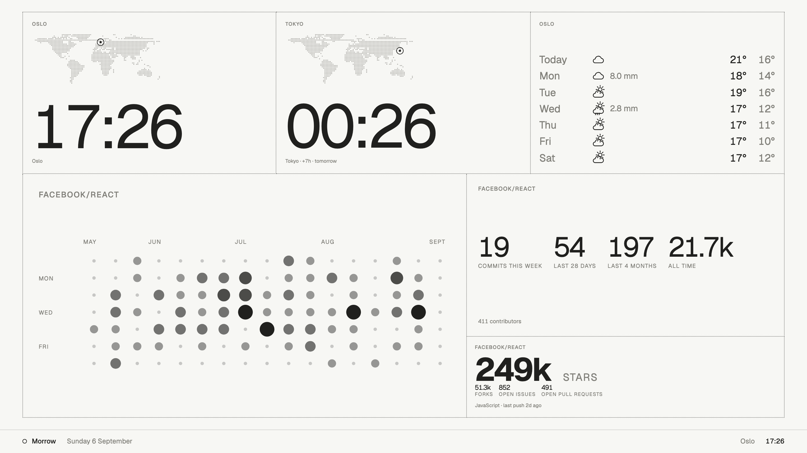
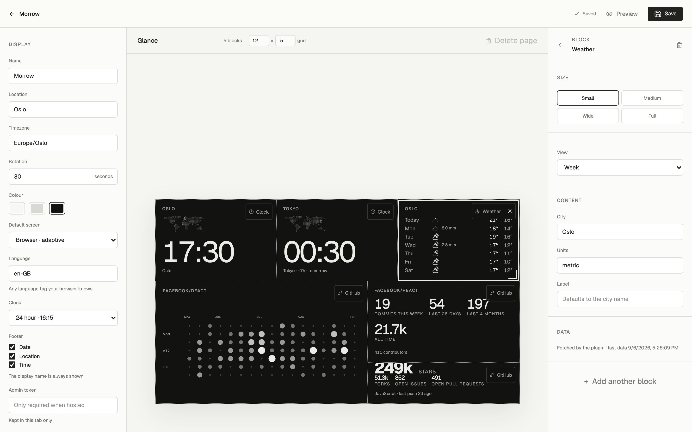
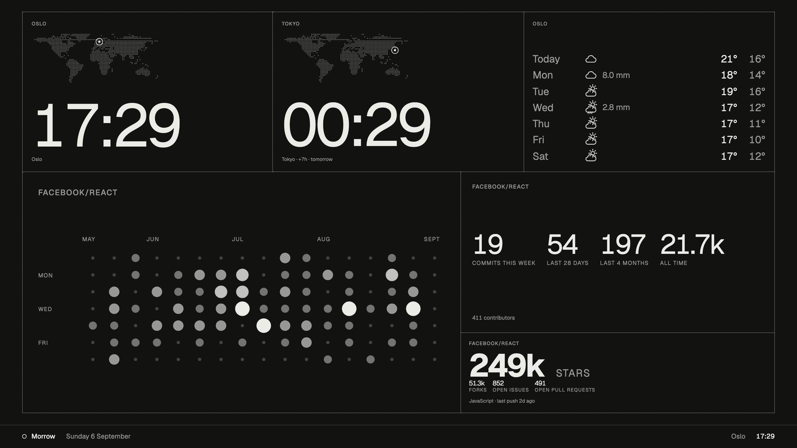

# Morrow Glance

A calm, open-source ambient display for browsers: wall TVs, tablets, kiosk screens.

Morrow keeps content, layout, and output separate:

- **Morrow Player** presents a responsive Glance in any modern browser.
- **Morrow Screens** describe the screens the Glance is designed for, such as a 4K TV or an upright tablet.
- **Morrow Plugins** provide content and views without coupling integrations to the Player.
- **Morrow Server** stores one shared configuration in Cloudflare D1 and serves it to Admin and every Player.



Self-host it with `docker compose up`, or deploy it to Cloudflare Workers. Storage is SQLite or D1 behind one small adapter, so the same code runs either way.

A clean installation intentionally starts with an empty Glance. There is no sample content or simulated data.

## Run locally

Morrow requires Node.js 22.13 or newer.

```bash
npm install
npm run dev
```

Open `http://localhost:3000` for the Player and `http://localhost:3000/admin` for Admin. A local D1 database is created automatically under `.wrangler/`.

Other scripts:

| Script           | Purpose                                                      |
| ---------------- | ------------------------------------------------------------ |
| `npm run check`  | Format check, lint, typecheck, and unit tests (what CI runs) |
| `npm test`       | Unit and behaviour tests                                     |
| `npm run format` | Fix formatting                                               |
| `npm run build`  | Production build into `dist/`                                |

## Admin

Admin is the visual control surface for the system. It supports:

- display name, location, timezone, paper colour, and page rotation;
- which of the date, location, and time the footer shows, for when a block already carries that information;
- adding, naming, and removing pages;
- dragging plugins from the library onto the page grid, moving blocks, and resizing them from a corner handle, with keyboard nudging for accessibility;
- adding screens from presets or as a custom size.



Save writes the configuration to Morrow Server. Every Player also keeps a local copy of the last configuration it received, so a screen keeps showing its Glance if the server is temporarily unavailable.

## Screens

A screen is a reference size the layout is designed against plus a refresh interval. The Player adapts to the real viewport, so the same Glance works on a phone held in the hand and a television on the wall. Open `/?screen=<id>` on a device to make its Player follow that screen's refresh interval; without the parameter the default screen applies.

A clean install has one screen, **Browser · adaptive**. Admin can add more from the built-in presets or as a custom size:

| Preset             | Reference size |
| ------------------ | -------------: |
| Browser · adaptive |    1920 × 1080 |
| Tablet · portrait  |    1024 × 1366 |
| TV · 4K            |    3840 × 2160 |

Presets live in `lib/morrow/screens/`, one file each. Adding a new kind of screen is a new file and one line in `lib/morrow/screens/index.ts`.

## API

| Endpoint                      | Purpose                                                                                                         |
| ----------------------------- | --------------------------------------------------------------------------------------------------------------- |
| `GET /api/config`             | Read the shared Morrow configuration. Returns its version stamp in `x-morrow-updated-at`.                       |
| `PUT /api/config`             | Validate and save the shared configuration. Send the stamp as `If-Match` to be told about conflicts with `409`. |
| `GET /api/data`               | Latest data for every block with a data source, refreshing stale poll sources on the way.                       |
| `POST /api/webhooks/:blockId` | Deliver JSON to a block that uses the webhook strategy. Requires `MORROW_WEBHOOK_TOKEN`.                        |
| `GET /api/geocode?q=`         | Place search for Admin's city picker, gated like a configuration write.                                         |

Invalid configurations are rejected with `400` and a message naming the field, for example `pages[0].blocks[2]: extends past the last column`.

## Configure a Glance in code

`morrow.config.ts` is the clean-install fallback and defines the same structure that Admin saves. All durations are in seconds. The palette stays deliberately limited:

```ts
color: 'white'; // 'white' | 'grey' | 'black'
```

Every page owns a grid and plugin blocks. The default page is empty:

```ts
{
  id: 'glance',
  label: 'Glance',
  layout: { columns: 12, rows: 5 },
  blocks: [],
}
```

With multiple pages, the Player automatically enables tabs, rotation, touch gestures, and keyboard navigation.

## Design language

The Player borrows from e-paper companions and from Linear and reMarkable: one ink on one paper, dotted hairlines where two blocks meet, and a single quiet footer under a very faint rule that carries the display name, date, location, and time as plain text. There is no header; the whole screen above the footer belongs to blocks. Each optional footer field can be switched off in Admin, so a display whose blocks already show the time need not repeat it, while the name stays as the screen's identity. Hairlines and the footer scale with the viewport, so a 4K television reads like a 7-inch panel held closer.

Typography is one system with two weights, and every size is a token that scales with the block or the viewport, so plugins by different authors set the same way. Blocks never have fills or shadows, so a layout reads the same in white, grey, and black. Dividers and the footer rule derive from the ink colour, which is why a new theme only needs `--paper` and `--ink`.



Anything read from the API, the database, or the browser passes through `parseMorrowConfig` in `lib/morrow/config.ts`, which strips unknown keys, checks ranges and ids, and refuses overlapping blocks. Older configurations that stored `rotationMs` or `deviceProfiles` are migrated on read.

## Data sources

A block can get live data without anyone writing code. In Admin, select a block whose plugin accepts data and choose a source:

| Strategy    | How it works                                                                                                                                                                                                           | Good for                                                                                                       |
| ----------- | ---------------------------------------------------------------------------------------------------------------------------------------------------------------------------------------------------------------------- | -------------------------------------------------------------------------------------------------------------- |
| **Static**  | No source. The view renders from its settings.                                                                                                                                                                         | Clocks, notes, labels.                                                                                         |
| **Poll**    | Morrow Server fetches a public HTTPS JSON URL on an interval you choose (at least 60 s). It fetches lazily, whenever a Player asks for data and the interval has elapsed, so nothing runs while no screen is watching. | Open APIs: weather, transit, air quality, public counters.                                                     |
| **Webhook** | An external system sends JSON to `POST /api/webhooks/<blockId>`. Each delivery replaces the block's data.                                                                                                              | Anything with credentials or internal data: Power Automate, n8n, Home Assistant, a script in your own network. |

Views receive the data as a `data` prop. The built-in **Value** plugin shows one field from it with a dotted path such as `main.temp`. Plugins that know where their data lives can declare `source(settings)` in their manifest instead; the **Weather** plugin builds its MET Norway URL from the picked city's coordinates, so there is nothing to configure beyond the city.

Plugins that need credentials add a `server.ts` beside their `plugin.tsx`. It runs only in Morrow Server, reads secrets from the environment, and returns the data the views get. The **Calendar** plugin uses this to read Microsoft 365 calendars, either from a published Outlook link stored as a per-block secret, or live through Microsoft Graph with application permissions; see `plugins/calendar/README.md`. The **GitHub** plugin does the same with a personal access token for a contribution heatmap, an activity feed, or a repository's stars and open work; see `plugins/github/README.md`.

**Per-block secrets.** A `secret` setting is stored on Morrow Server for that block only, through `PUT /api/blocks/:id/secrets`, and is never returned or written into the configuration. Plugin server modules receive it in `context.secrets`. Secrets are removed when their block is deleted.

Safety rules that are enforced, not just documented: poll URLs must be public HTTPS, and loopback, private, link-local, and internal-looking hosts are refused so the server cannot be pointed at its own network. Responses and webhook bodies are capped at 64 KB, polls time out after eight seconds, and redirects are not followed. Webhooks are disabled until `MORROW_WEBHOOK_TOKEN` is set. Keep credentials out of poll URLs: the configuration is readable by every Player, so an authenticated source should push data with a webhook instead. Everything delivered to a block is public to whoever can open a Player.

## Plugins

A plugin is a folder under `plugins/` with a `plugin.tsx` that exports `plugin`, its own `plugin.css`, and a `README.md`. Every such folder is discovered automatically; there is no registry to edit. Folders starting with an underscore are ignored, which is how `plugins/_template/` stays out of the library.

```text
plugins/
  clock/      plugin.tsx · plugin.css · README.md
  text/       plugin.tsx · plugin.css · README.md
  _template/  copy me to start a new plugin
```

Views are ordinary React components that receive the current time, the display's timezone, the block's settings, and, when the block has a data source, its latest `data`. Set `acceptsData: true` in the manifest to let Admin offer poll and webhook sources for the plugin. They render inside a CSS container, so size text with container units such as `cqmin` rather than `vw`; the same view then scales correctly in the Player and on the Admin canvas. Use the `plugin-view` and `plugin-label` classes for the shared padding and label style.

```tsx
import { Sparkles } from 'lucide-react';

import { readStringSetting } from '@/lib/morrow/settings';
import { definePlugin } from '@/lib/morrow/types';

import './plugin.css';

export const plugin = definePlugin({
  manifest: {
    id: 'example.plugin',
    name: 'Example',
    version: '0.1.0',
    description: 'A short description.',
    refreshSeconds: 300,
    views: [{ id: 'default', name: 'Default' }],
    settings: [{ id: 'label', label: 'Label', type: 'text' }],
    defaultSize: { span: 6, rowSpan: 2 },
    minSize: { span: 2, rowSpan: 1 },
  },
  icon: Sparkles,
  views: {
    default: function DefaultView({ now, settings }) {
      return (
        <div className="plugin-view">
          <span className="plugin-label">
            {readStringSetting(settings, 'label')}
          </span>
          <strong>{now.toLocaleTimeString()}</strong>
        </div>
      );
    },
  },
});
```

**Installed versus enabled.** Everything in `plugins/` is installed, ships with the build, and appears in Admin's library. An install can hide plugins it does not want by listing their ids in `disabledPlugins` in `morrow.config.ts` or through the config API. A newly added plugin is enabled by default, and blocks that already use a disabled plugin keep rendering.

**Sharing plugins.** Contribute a plugin by opening a pull request that adds its folder. The README in the folder is its documentation. As the catalogue grows, plugins can also be published as npm packages and dropped into `plugins/` by a project; the folder contract stays the same. Morrow deliberately does not load plugin code at runtime from URLs, because every screen would then execute arbitrary code.

See `CONTRIBUTING.md` for the full module map and conventions.

## Storage and access

Morrow keeps one configuration, the data its blocks have fetched, and any
per-block secrets. All of it is SQL, in three small tables under `migrations/`.

Storage sits behind one adapter (`db/adapter.ts`) with two implementations, so
the rest of the code is identical either way:

| Runtime            | Storage                              | Chosen when                             |
| ------------------ | ------------------------------------ | --------------------------------------- |
| Node               | SQLite, via the runtime's own driver | Anywhere that is not Cloudflare Workers |
| Cloudflare Workers | D1, through the `DB` binding         | Detected at runtime                     |

Self-hosted, the file lives at `./data/morrow.db`, or wherever
`MORROW_SQLITE_PATH` points. There is nothing to install: Node 22 ships SQLite.

Access is deliberately simple:

- **Development is open on localhost.** With no token configured, the dev server accepts saves from localhost so a fresh checkout works immediately.
- **Production requires a token.** A production build refuses every save until `MORROW_ADMIN_TOKEN` is set, and Admin says so plainly. Enter the token in Admin; the browser keeps it only for the current tab. The hostname check is not used in production because a proxy may forward `Host: localhost`.
- **Two admins cannot overwrite each other.** Every save carries the version stamp of the configuration it started from. If someone else saved in between, the API answers `409`, Admin explains, and offers a reload.
- **Reads are public.** `GET /api/config` and `GET /api/data` have no authentication, because a Player is meant to be opened on any screen. Do not put anything on a Glance that must stay private, and keep an exposed instance behind a network you trust or a proxy that adds access control.

## Deploy

### Self-hosted with Docker

The shortest path, and the one to prefer when data must stay on your own
infrastructure. Storage is a SQLite file in a volume; nothing else is needed.

```bash
echo "MORROW_ADMIN_TOKEN=$(openssl rand -hex 32)" > .env
docker compose up -d
```

Open `http://localhost:3000` for the Player and `/admin` to build a Glance.
Paste the token from `.env` into Admin's token field once per browser tab.
The configuration lives in the `morrow-data` volume, so `docker compose pull`
and `up -d` again keeps it.

### Self-hosted without Docker

```bash
npm ci
npm run build:node
MORROW_ADMIN_TOKEN=… node dist/standalone/server.js
```

`PORT` defaults to 3000 and `HOST` to `0.0.0.0`. Point `MORROW_SQLITE_PATH` at
a path you back up. The bundle carries its own dependencies, so the machine
only needs Node 22.

A known cosmetic issue in the self-hosted bundle: the console logs one
`RSC prefetch setup error` on load. It comes from vinext's standalone output,
affects link prefetching only, and neither Player nor Admin is impaired.

### Cloudflare Workers

```bash
npm run build
npx @vinext/cloudflare deploy
```

Bind a D1 database as `DB` and apply the migrations with
`npx wrangler d1 migrations apply <database-name> --remote`. Set the variables
as Worker secrets. Note that Workers run wherever the request lands and D1 sits
in a Cloudflare region, so check where your data may live before choosing this
for anything with personal data in it.

### Variables

See `.env.example` for the full list. Locally, the Cloudflare runtime reads
`.dev.vars` (copy `.dev.vars.example`) rather than the shell environment; the
self-hosted server reads the environment directly.

Set `MORROW_BUILD_ID` to the release you deployed. Players compare it on every
poll and reload themselves once a new id has answered twice in a row, at most
once every ten minutes, so wall screens pick up a release without anyone
touching them and never loop during a gradual rollout.

The repository also carries `@openai/sites-vite-plugin` and
`.openai/hosting.json`, which package the same build for OpenAI Sites hosting.
Remove both if you deploy elsewhere; they do not affect other targets.

## Project shape

```text
app/                         Player, Admin, and the config API
components/                  Player and Admin components
db/                          Storage: one adapter, SQLite and D1 behind it
lib/morrow/                  Contracts, validation, grid math, screens, access checks
migrations/                  Durable storage schema
plugins/                     Installed plugins and their views
morrow.config.ts             Clean-install fallback configuration
```

The initial plugin library: a world clock with digital, analog, and map views, a weather forecast for any place on Earth, a Microsoft 365 calendar for rooms, shared mailboxes, and people, a user-authored text block, and a Value block that shows one field from live data. `plugins/_template/` is a starting point for new ones.

## Direction

The platform boundary is now in place. The next additions can remain small and focused: per-screen layout hints, richer page scheduling, and real integration plugins that fetch through Morrow Server without placing credentials on a display.

## Contributing

Issues, ideas, and focused pull requests are welcome. Read `CONTRIBUTING.md` first. Keep the core small; integrations should remain plugins.

## Data credits

The world clock's city search uses [GeoNames](https://www.geonames.org/) data (CC BY 4.0), and its map uses [Natural Earth](https://www.naturalearthdata.com/) land shapes (public domain), both bundled as compact generated files under `lib/morrow/geo/`. Regenerate them with `npm run geo`. Weather forecasts come from [MET Norway](https://api.met.no/) (CC BY 4.0) and are fetched by Morrow Server at display time. Admin's place search adds results from the [Open-Meteo geocoding API](https://open-meteo.com/) (GeoNames data, CC BY 4.0) through Morrow Server, so villages and towns are found too; typed coordinates work for anywhere else.

## License

MIT
